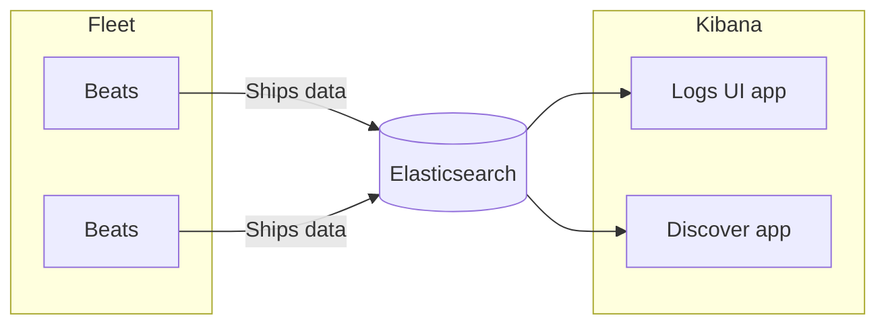

The Elastic documentation engine allows for markdown-like content using [MDX](https://mdxjs.com). We often replace and augment the core markdown syntax with React-powered renders that provide additional functionality. In all cases these components are preceeded with the `Docs` prefix.

## Frontmatter

Every MDX document needs to include the following frontmatter.

* `id` (**required**) Must be unique, should never change. Used to define relations between articles and linking systems.
* `slug` (**required**) Defines the url path for the page. Should use a prefix to prevent conflicts.
* `title` (**required**) Default title display for the document in page headers and links.
* `image` Image used for cards and other graphical lists when linking to this article.
* `summary` One-liner that describes the purpose of the article.
* `date` Last updated or verified date for the article.
* `tags` Categories that help define related articles.

```yaml
---
id: docsSyntax
slug: /docs/syntax
title: Docs syntax
image: https://source.unsplash.com/400x175/?Nature
summary: Code syntax and examples for the custom widgets we use to write the docs.
date: 2020-07-08
tags: ['observability','kibana','elasticsearch','beats']
---

# Frontmatter starts at the top of the document

Frontmatter needs to appear on every MDX document at the start of the page.

```

For more details about recommended values, refer to <DocLink id="docsGuidelines" />.

## Reserved syntax

The characters `<>` and `{}` are reserved for variables and components.
As text, they can only be added to documentation files when in code blocks or snippets.

## Emoji

Emoji get proper a11y automatically! 💯


## Images

Images use the plain Markdown format. They are transformed to [EuiImage](https://elastic.github.io/eui/#/display/image) components behind-the-scenes.

```md

```


You can also use relative paths to your images. For example:

```md

```


## Links

Links come in two formats. For internal links within the site, utilize the `DocLink` component which will fetch the `slug` and `title` from the article's frontmetter. You may optionally include the `tooltip` prop which will provide wikipedia-style link previews.

### Internal links

```html
<DocLink id="docsSyntax" />
<DocLink id="docsSyntax" text="Different link text"/>
<DocLink id="docsSyntax" tooltip />
<DocLink id="docsSyntax" section="links" text="Linking to a specific section" />
```

* <DocLink id="docsSyntax" />
* <DocLink id="docsSyntax" text="Different link text"/>
* <DocLink id="docsSyntax" tooltip />
* <DocLink id="docsSyntax" section="links" text="Linking to a specific section" />

### External links

External links use regular Markdown formatting. `rel="no-follow"` will be automatically applied. It will transform into an [EuiLink]() with the `external` prop applied.

```md
[Elastic's homepage](https://elastic.co)
```

[Elastic's homepage](https://elastic.co)

## DocCallOut

Use a `DocCallOut` to highlight a piece of content. You can add a title on its
own to tell the user something important, or use the title to call attention to
content you want to further explain.

```html

<DocCallOut title="Default callout with Markdown">
  If you don't specify `color`, the default `DocCallOut` color is blue.

  You can add **Markdown** syntax *and* other doc components, like <DocLink id="docsSyntax" text="this link"/>.
</DocCallOut>

<DocCallOut color="warning" title="This title needs no description" />

<DocCallOut color="danger" title="This title alerts users to something serious">
  So serious, that we need to tell you more about it.
</DocCallOut>
```

<DocCallOut title="Default callout with Markdown">
  If you don't specify `color`, the default `DocCallOut` color is blue.

  You can add **Markdown** syntax *and* other doc components, like <DocLink id="docsSyntax" text="this link"/>.
</DocCallOut>

<DocCallOut color="warning" title="This title needs no description" />

<DocCallOut color="danger" title="This title alerts users to something serious">
  So serious, that we need to tell you more about it.
</DocCallOut>

### Predefined callouts
Use predefined callouts by specifying a template.

```html
<DocCallOut template="development" />
<DocCallOut template="beta" />
<DocCallOut template="experimental" />
```

<DocCallOut template="development" />
<DocCallOut template="beta" />
<DocCallOut template="experimental" />
## Lists

You can create lists using typical Markdown format.

To add another element in a list while preserving the continuity of the list,
indent the element four spaces or one tab.

### Definition lists

To create a definition list, type the term on the first line. On the next line,
type a colon followed by a space and the definition. For example:

```md
Term 1

: Definition 1

`Term 2`

: Definition 2
```

Term 1

: Definition 1

`Term 2`

: Definition 2

### Ordered lists

To create an ordered list, use numbers followed by periods. The numbers don’t
have to be in numerical order, but the list should start with the number one.
For example:

```
1. First item
3. Second item
5. Third item
    1. Indented item
    2. Indented item
8. Fourth item
```

1. First item
3. Second item
5. Third item
    1. Indented item
    2. Indented item
8. Fourth item

### Unordered lists

To create an unordered list, use dashes (-), asterisks (*), or plus signs (+).
Indent one or more items to create a nested list. For example:

```
- First item
- Second item
- Third item
    - Indented item
    - Indented item
- Fourth item
```

- First item
- Second item
- Third item
    - Indented item
    - Indented item
- Fourth item

## Math

Math is handled through [remark-math](https://github.com/Rokt33r/remark-math) which supports latex style math notation.

```md
$a^2 + b^2 = c^2$

$$
a^2 + b^2 = c^2
$$
```

$a^2 + b^2 = c^2$

$$
a^2 + b^2 = c^2
$$

## Video

The `DocVideo` component allows you to embed video. The `id` and `title` props are required. The source `source` prop accepts `youtube` or `gdrive`.

```jsx
<DocVideo id="lcWKALztQ5A" title="Some YouTube video" />

<DocVideo id="1c9NzJ22UMoJKXXz1j4pgDcopATMMAojb" source="gdrive" title="Some gdrive video" />
```

<DocVideo id="lcWKALztQ5A" title="Some YouTube video" />

<DocVideo id="1c9NzJ22UMoJKXXz1j4pgDcopATMMAojb" source="gdrive" title="Some gdrive video" />


## Mermaid charts

[Mermaid](https://mermaid-js.github.io/mermaid/#/) is a charting library where you can render charts from a simple markdown block.

```shell
graph LR
    B1[Beats] -- Ships data --> ES[(Elasticsearch)]
    B2[Beats] -- Ships data --> ES
    subgraph Fleet
      B1
      B2
    end
    subgraph Kibana
      LOG[Logs UI app]
      DISC[Discover app]
    end
    ES --> LOG
    ES --> DISC
```



## Code blocks

Code bocks use typical markdown `code` blocks using back-ticks \`\`\`. You can optionally include the language on the first line to provide highlighting for that language.

```tsx
export const EuiIconTip: FunctionComponent<Props> = ({
  type = 'questionInCircle',
  'aria-label': ariaLabel = 'Info',
  color,
  size,
  iconProps,
  position = 'top',
  delay = 'regular',
  ...rest
}) => (
  <EuiToolTip position={position} delay={delay} {...rest}>
    <EuiIcon
      tabIndex={0}
      type={type}
      color={color}
      size={size}
      aria-label={ariaLabel}
      {...iconProps}
    />
  </EuiToolTip>
);
```

## Tables

Tables can accept typical markdown structure using pipes. Note that there are several extensions for many code editors that will help you auto-align and space your markdown tables.

```markdown
| Tables        | Are           | Cool  |
| ------------- |:-------------:| -----:|
| col 3 is      | right-aligned | $1600 |
| col 2 is      | centered      |   $12 |
| zebra stripes | are neat      |    $1 |
```

| Tables        | Are           | Cool  |
| ------------- |:-------------:| -----:|
| col 3 is      | right-aligned | $1600 |
| col 2 is      | centered      |   $12 |
| zebra stripes | are neat      |    $1 |

There must be at least 3 dashes separating each header cell. The outer pipes (|)
are optional, and you don't need to make the raw Markdown line up prettily. You
can also use inline Markdown.

## Accordion

```jsx
<DocAccordion buttonContent="Hello there">
  I am some **markdown** content

  I can also accept other components inside.

  <DocCallOut template="experimental" />

</DocAccordion>

<DocAccordion buttonContent="Click me for fun stuff" initialIsOpen>
  This accordion is open initially by using `initialIsOpen`

  <DocAccordion buttonContent="A nested example">
    This is a really bad idea, so don't do it often
  </DocAccordion>
</DocAccordion>


```

<DocAccordion buttonContent="Click me for fun stuff">
  I am some **markdown** content

  I can also accept other components inside.

  <DocCallOut template="experimental" />

</DocAccordion>

<DocAccordion buttonContent="Click me for fun stuff" initialIsOpen>
  This accordion is open initially by using `initialIsOpen`

  <DocAccordion buttonContent="A nested example">
    This is a really bad idea, so don't do it often
  </DocAccordion>
</DocAccordion>


## Comments

Comments are text strings that are not rendered in the output.
To create a comment, use the following syntax:

```md
{/* I'm a comment */}
```